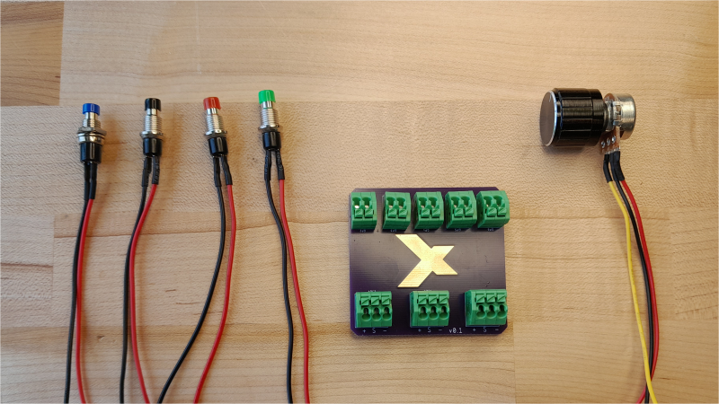
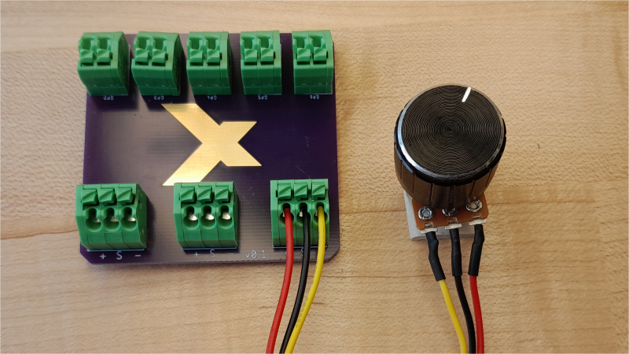

# Challenge
You are tasked with creating a hardware device to play [Tetris in the browser](https://tetris.com/play-tetris). We have provided some pre-programmed boards that handle most of the electronics and coding, but you will need to build the physical interface.

You must choose a target user and scenario for whom you're making your device.

# Table of Contents
- [Getting Started](#getting-started)
- [Materials](#materials)
- [Electrical Assembly](#electrical-assembly)
- [Code](src/)
- [Mechanical Design](cad/)
- [Extra Credit](#extra-credit)

# Getting Started
1. Assemble the electronics and see how they work with Tetris. Try playing it on a computer and make sure you get the button presses you expect. See the table in the [Operation section.](#operation)
1. Come up with a target user and scenario for whom you're making your device. Spend about 10 minutes coming up with this.
1. Build the enclosure using the tools in the Prototyping Labs. Cardboard and hot glue is perfectly fine, but feel free to stretch a little and try using the lasers or any other tool in the main area.
1. Test your prototype.
1. Make your prototype better based on your test.

# Materials

- Raspberry Pi Pico main board
- Micro USB cable
- Switches
- Potentiometer
- Anything you can find in the Prototyping Labs

# Electrical Assembly
The button wires go into the green terminal blocks with two holes. It does not matter which end goes into which hole since these buttons are not polarized. You will need to depress the square on the top of the green terminal block to let the wire slip in.

The potentiometer wires go into the green terminal blocks with three holes. The black wire needs to go into the center hole, but the other two can be place in either side hole (but not the same one!).

# Operation

| Pin | Keystroke |
| --- | --- |
| GP2 | Left Button |
| GP3 | Right Button |
| GP4 | Up Button (rotate the piece) |
| GP5 | Spacebar (drop the piece)* |

*The code loaded on the device does not implement the spacebar button. For information on editing the code, [click here](src/). To achieve high scores, you'll need that functionality.

The potentiometer (knob) controls how fast bricks fall by "feathering" the down button. If the potentiometer is not wired, this feature will be deactivated.

# Extra Credit
- Fabrication
    - Lasercut and heat bend a controller. (Lasercutting tutorial takes about 30 minutes)
    - 3D print your controller. (very hard, but doable with the faster printers)
- Electronics
    - Find a different button to use with the board in the Prototyping Labs.
    - Use something other than a real button as a button.
- Coding
    - Implement the spacebar code.
    - Implement a series of commands instead of just one button press. For example, pressing the button connected to GP4 could send several rotation commands instead of one.
    - Edit the potentiometer code to have the blocks fall faster or slower.